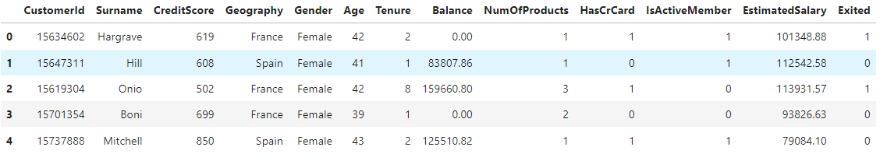
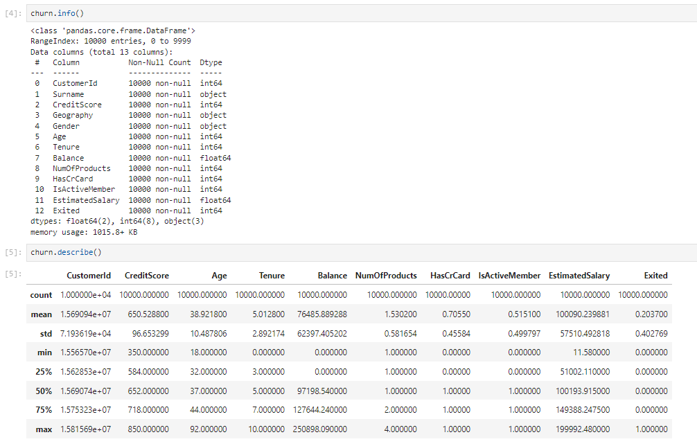
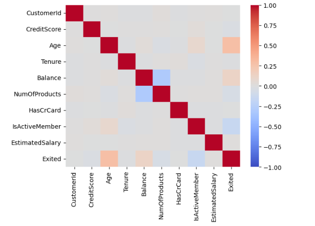
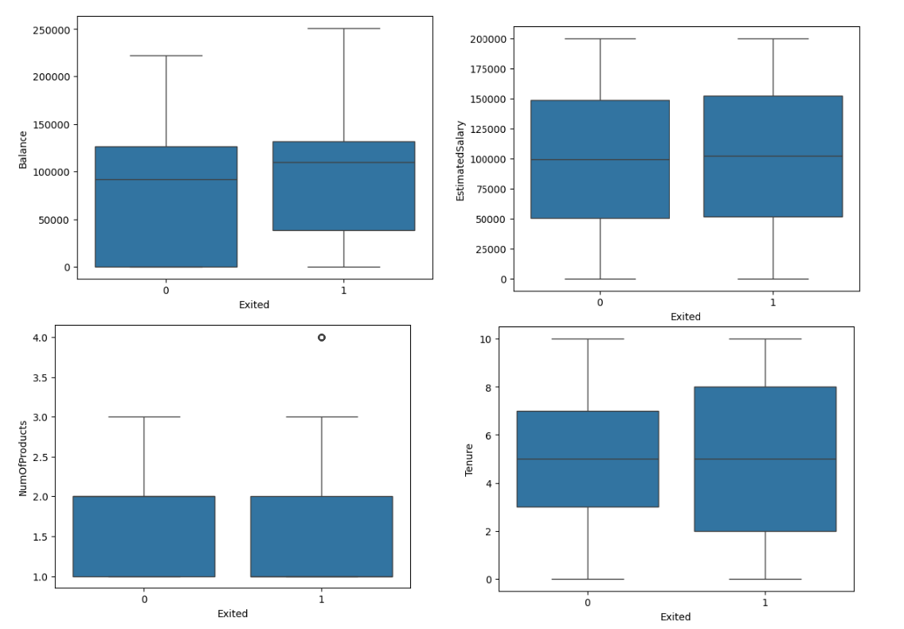
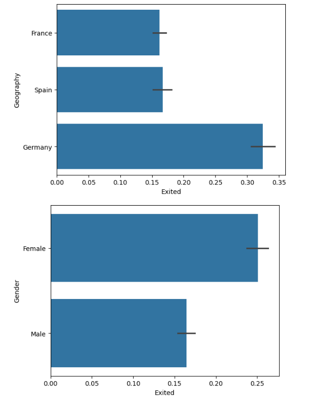

# 📊 **Bank Churn Analysis (Classification)**

## 📝 **Project Overview**  
In this project, I took on the role of a **Data Scientist** for the Bank of Mavenland. The objective was to help reduce customer churn by identifying clients at the highest risk of leaving. By leveraging data analysis and machine learning techniques, I built classification models to predict customer churn and provide insights for targeted retention strategies.

## 🎯 **Assignment Goals**  
The bank's product team aimed to increase revenue by minimizing churn rates. To achieve this, I developed a classification model capable of identifying high-risk customers, enabling the business to proactively address potential churn.

## 🚀 **Project Objectives**  

1. **Data Exploration**: Load and explore the dataset to understand patterns and anomalies.  

2. **Data Preparation**: Clean and preprocess the data for optimal model performance.  

3. **Model Building**:  
    - Develop and evaluate a **Logistic Regression** model.  
    - Build and fine-tune a **Random Forest** model.  

4. **Model Evaluation**: Compare model performance and select the best approach for identifying churn-prone customers.

## 🛠️ **Technologies Used**  

- **Python**  
- **Pandas**  
- **Scikit-Learn**  
- **Matplotlib / Seaborn**  
- **Jupyter Notebook**

## 📈 **Results**  
The project delivers a comprehensive analysis and predictive models that can identify customers at high risk of churn, helping the bank take data-driven actions to improve customer retention.

## 🚀 **Objective 1: Profile & Explore the Data**

Your first objective is to import the data and explore relationships between the features and the target variable.

1. **Import the `Churn_Modeling.csv` file** and set an **appropriate data type** for each column.  
 
   
     

3. **Check for missing values** and calculate the **min, max, and mean** for numeric columns.  
   

4. **Build a scatterplot matrix** to find relationships between all pairs of numeric columns.  
   

5. **Build box plots** for each numeric column broken out by the target variable, **“Exited”**.  
   

6. **Build bar charts** that show the percentage of **“Exited”** by category for each categorical column.  
   

